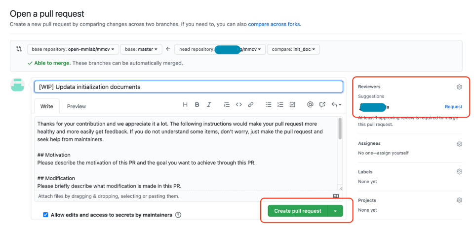

## PR

### What is PR
`PR` is the abbreviation of `Pull Request`. Here's the definition of `PR` in the [official document](https://docs.github.com/en/github/collaborating-with-pull-requests/proposing-changes-to-your-work-with-pull-requests/about-pull-requests) of Github.

> Pull requests let you tell others about changes you've pushed to a branch in a repository on GitHub. Once a pull request is opened, you can discuss and review the potential changes with collaborators and add follow-up commits before your changes are merged into the base branch.

### Basic Workflow
1. Fork and pull the latest OpenMMLab repository
2. Checkout a new branch for PR
3. Commit your changes
4. Create a PR

### Procedures in detail
1. Fork the source OpenMMLab repository. Just click the **fork** button at the top right corner of Github page \


2. Clone forked repository to local
```bash
git clone git@github.com:XXX/mmcv.git
```

3. Add source repository to upstream
```bash
git remote add upstream git@github.com:open-mmlab/mmcv
```

4. Pull latest master branch of source repository
```bash
git pull upstream master
```

5. Checkout a new branch for PR
```bash
git checkout -b branchname
# coding
git add [files]
git commit -m 'messages'
```

6. Push your changes to forked repository
```bash
git push origin branchname
```

7. Create a PR


8. Revise PR message template to describe the your motivation and modifications made in this PR
9. After creating a pull request, you can ask a specific person to review the changes you've proposed


10. Associate related issues and pull requests with a milestone
11. Modify your codes according to reviewer's suggestions, and then push your changes
12. Delete the branch after PR merged
```bash
git branch -d branchname # delete local branch
git push origin --delete branchname # delete remote branch
```

### PR Specs
1. Use [pre-commit](https://pre-commit.com) hook to avoid issues of code style
2. One short-time branch should be matched with only one PR
3. Accomplish a detailed change in one PR. Avoid large PR
>- Bad: Support Faster R-CNN
>- Acceptable: Add a box head to Faster R-CNN
>- Good: Add a parameter to box head to support custom conv-layer number
4. Provide clear and significant commit message
5. Provide clear and meaningful PR description
>- Task name should be clarified in title. The general format is: [Prefix] Short description of the PR (Suffix)
>- Prefix: add new feature [Feature], fix bug [Fix], related to documents [Docs], in developing [WIP] (which will not be reviewed temporarily)
>- Introduce main changes, results and influences on other modules in short description
>- Associate related issues and pull requests with a milestone