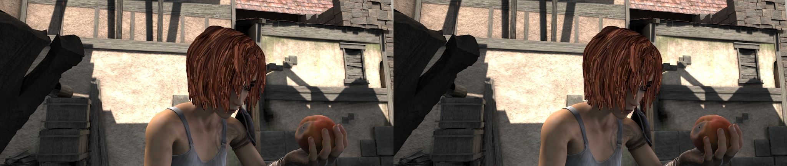
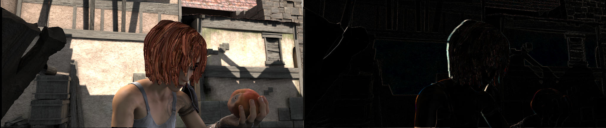

## Data Process

### Image

This module provides some image processing methods, which requires `opencv` to be installed first.

#### Read/Write/Show

To read or write images files, use `imread` or `imwrite`.

```python
import mmcv

img = mmcv.imread('test.jpg')
img = mmcv.imread('test.jpg', flag='grayscale')
img_ = mmcv.imread(img)  # nothing will happen, img_ = img
mmcv.imwrite(img, 'out.jpg')
```

To read images from bytes

```python
with open('test.jpg', 'rb') as f:
    data = f.read()
img = mmcv.imfrombytes(data)
```

To show an image file or a loaded image

```python
mmcv.imshow('tests/data/color.jpg')
# this is equivalent to

for i in range(10):
    img = np.random.randint(256, size=(100, 100, 3), dtype=np.uint8)
    mmcv.imshow(img, win_name='test image', wait_time=200)
```

#### Color space conversion

Supported conversion methods:

- bgr2gray
- gray2bgr
- bgr2rgb
- rgb2bgr
- bgr2hsv
- hsv2bgr

```python
img = mmcv.imread('tests/data/color.jpg')
img1 = mmcv.bgr2rgb(img)
img2 = mmcv.rgb2gray(img1)
img3 = mmcv.bgr2hsv(img)
```

#### Resize

There are three resize methods. All `imresize_*` methods have an argument `return_scale`,
if this argument is `False`, then the return value is merely the resized image, otherwise
is a tuple `(resized_img, scale)`.

```python
# resize to a given size
mmcv.imresize(img, (1000, 600), return_scale=True)

# resize to the same size of another image
mmcv.imresize_like(img, dst_img, return_scale=False)

# resize by a ratio
mmcv.imrescale(img, 0.5)

# resize so that the max edge no longer than 1000, short edge no longer than 800
# without changing the aspect ratio
mmcv.imrescale(img, (1000, 800))
```

#### Rotate

To rotate an image by some angle, use `imrotate`. The center can be specified,
which is the center of original image by default. There are two modes of rotating,
one is to keep the image size unchanged so that some parts of the image will be
cropped after rotating, the other is to extend the image size to fit the rotated
image.

```python
img = mmcv.imread('tests/data/color.jpg')

# rotate the image clockwise by 30 degrees.
img_ = mmcv.imrotate(img, 30)

# rotate the image counterclockwise by 90 degrees.
img_ = mmcv.imrotate(img, -90)

# rotate the image clockwise by 30 degrees, and rescale it by 1.5x at the same time.
img_ = mmcv.imrotate(img, 30, scale=1.5)

# rotate the image clockwise by 30 degrees, with (100, 100) as the center.
img_ = mmcv.imrotate(img, 30, center=(100, 100))

# rotate the image clockwise by 30 degrees, and extend the image size.
img_ = mmcv.imrotate(img, 30, auto_bound=True)
```

#### Flip

To flip an image, use `imflip`.

```python
img = mmcv.imread('tests/data/color.jpg')

# flip the image horizontally
mmcv.imflip(img)

# flip the image vertically
mmcv.imflip(img, direction='vertical')
```

#### Crop

`imcrop` can crop the image with one or more regions. Each region is represented by the upper left and lower right coordinates as (x1, y1, x2, y2).

```python
import mmcv
import numpy as np

img = mmcv.imread('tests/data/color.jpg')

# crop the region (10, 10, 100, 120)
bboxes = np.array([10, 10, 100, 120])
patch = mmcv.imcrop(img, bboxes)

# crop two regions (10, 10, 100, 120) and (0, 0, 50, 50)
bboxes = np.array([[10, 10, 100, 120], [0, 0, 50, 50]])
patches = mmcv.imcrop(img, bboxes)

# crop two regions, and rescale the patches by 1.2x
patches = mmcv.imcrop(img, bboxes, scale=1.2)
```

#### Padding

There are two methods, `impad` and `impad_to_multiple`, to pad an image to the
specific size with given values.

```python
img = mmcv.imread('tests/data/color.jpg')

# pad the image to (1000, 1200) with all zeros
img_ = mmcv.impad(img, shape=(1000, 1200), pad_val=0)

# pad the image to (1000, 1200) with different values for three channels.
img_ = mmcv.impad(img, shape=(1000, 1200), pad_val=(100, 50, 200))

# pad the image on left, right, top, bottom borders with all zeros
img_ = mmcv.impad(img, padding=(10, 20, 30, 40), pad_val=0)

# pad the image on left, right, top, bottom borders with different values
# for three channels.
img_ = mmcv.impad(img, padding=(10, 20, 30, 40), pad_val=(100, 50, 200))

# pad an image so that each edge is a multiple of some value.
img_ = mmcv.impad_to_multiple(img, 32)
```

### Video

This module provides the following functionalities:

- A `VideoReader` class with friendly apis to read and convert videos.
- Some methods for editing (cut, concat, resize) videos.
- Optical flow read/write/warp.

#### VideoReader

The `VideoReader` class provides sequence like apis to access video frames.
It will internally cache the frames which have been visited.

```python
video = mmcv.VideoReader('test.mp4')

# obtain basic information
print(len(video))
print(video.width, video.height, video.resolution, video.fps)

# iterate over all frames
for frame in video:
    print(frame.shape)

# read the next frame
img = video.read()

# read a frame by index
img = video[100]

# read some frames
img = video[5:10]
```

To convert a video to images or generate a video from a image directory.

```python
# split a video into frames and save to a folder
video = mmcv.VideoReader('test.mp4')
video.cvt2frames('out_dir')

# generate video from frames
mmcv.frames2video('out_dir', 'test.avi')
```

#### Editing utils

There are also some methods for editing videos, which wraps the commands of ffmpeg.

```python
# cut a video clip
mmcv.cut_video('test.mp4', 'clip1.mp4', start=3, end=10, vcodec='h264')

# join a list of video clips
mmcv.concat_video(['clip1.mp4', 'clip2.mp4'], 'joined.mp4', log_level='quiet')

# resize a video with the specified size
mmcv.resize_video('test.mp4', 'resized1.mp4', (360, 240))

# resize a video with a scaling ratio of 2
mmcv.resize_video('test.mp4', 'resized2.mp4', ratio=2)
```

#### Optical flow

`mmcv` provides the following methods to operate on optical flows.

- IO
- Visualization
- Flow warping

We provide two options to dump optical flow files: uncompressed and compressed.
The uncompressed way just dumps the floating numbers to a binary file. It is
lossless but the dumped file has a larger size.
The compressed way quantizes the optical flow to 0-255 and dumps it as a
jpeg image. The flow of x-dim and y-dim will be concatenated into a single image.

1. IO

```python
flow = np.random.rand(800, 600, 2).astype(np.float32)
# dump the flow to a flo file (~3.7M)
mmcv.flowwrite(flow, 'uncompressed.flo')
# dump the flow to a jpeg file (~230K)
# the shape of the dumped image is (800, 1200)
mmcv.flowwrite(flow, 'compressed.jpg', quantize=True, concat_axis=1)

# read the flow file, the shape of loaded flow is (800, 600, 2) for both ways
flow = mmcv.flowread('uncompressed.flo')
flow = mmcv.flowread('compressed.jpg', quantize=True, concat_axis=1)
```

2. Visualization

It is possible to visualize optical flows with `mmcv.flowshow()`.

```python
mmcv.flowshow(flow)
```


3. Flow warping

```python
img1 = mmcv.imread('img1.jpg')
flow = mmcv.flowread('flow.flo')
warped_img2 = mmcv.flow_warp(img1, flow)
```

img1 (left) and img2 (right)



optical flow (img2 -> img1)


warped image and difference with ground truth


