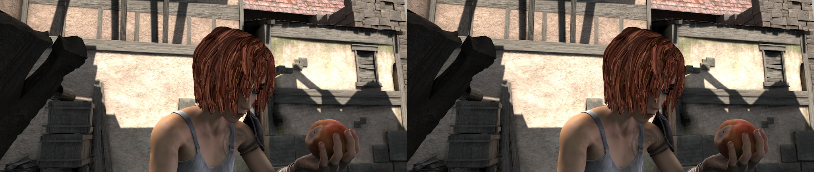

## Video

This module provides the following functionalities.

- A `VideoReader` class with friendly apis to read and convert videos.
- Some methods for editing (cut, concat, resize) videos.
- Optical flow read/write/warp.


### VideoReader

The `VideoReader` class provides sequence like apis to access video frames.
It will internally cache the frames which have been visited.

```python
video = mmcv.VideoReader('test.mp4')

# obtain basic information
print(len(video))
print(video.width, video.height, video.resolution, video.fps)

# iterate over all frames
for frame in video:
    print(frame.shape)

# read the next frame
img = video.read()

# read a frame by index
img = video[100]

# read some frames
img = video[5:10]
```

To convert a video to images or generate a video from a image directory.

```python
# split a video into frames and save to a folder
video = mmcv.VideoReader('test.mp4')
video.cvt2frames('out_dir')

# generate video from frames
mmcv.frames2video('out_dir', 'test.avi')
```

### Editing utils

There are also some methods for editing videos, which wraps the commands of ffmpeg.

```python
# cut a video clip
mmcv.cut_video('test.mp4', 'clip1.mp4', start=3, end=10, vcodec='h264')

# join a list of video clips
mmcv.concat_video(['clip1.mp4', 'clip2.mp4'], 'joined.mp4', log_level='quiet')

# resize a video with the specified size
mmcv.resize_video('test.mp4', 'resized1.mp4', (360, 240))

# resize a video with a scaling ratio of 2
mmcv.resize_video('test.mp4', 'resized2.mp4', ratio=2)
```

### Optical flow

`mmcv` provides the following methods to operate on optical flows.

- IO
- Visualization
- Flow warpping

We provide two options to dump optical flow files: uncompressed and compressed.
The uncompressed way just dumps the floating numbers to a binary file. It is
lossless but the dumped file has a larger size.
The compressed way quantizes the optical flow to 0-255 and dumps it as a
jpeg image. The flow of x-dim and y-dim will be concatenated into a single image.

```python
flow = np.random.rand(800, 600, 2).astype(np.float32)
# dump the flow to a flo file (~3.7M)
mmcv.flowwrite(flow, 'uncompressed.flo')
# dump the flow to a jpeg file (~230K)
# the shape of the dumped image is (800, 1200)
mmcv.flowwrite(flow, 'compressed.jpg', quantize=True, concat_axis=1)

# read the flow file, the shape of loaded flow is (800, 600, 2) for both ways
flow = mmcv.flowread('uncompressed.flo')
flow = mmcv.flowread('compressed.jpg', quantize=True, concat_axis=1)
```

It is possible to visualize optical flows with `mmcv.flowshow()`.

```python
mmcv.flowshow(flow)
```


3. Flow warpping

```python
img1 = mmcv.imread('img1.jpg')
flow = mmcv.flowread('flow.flo')
warpped_img2 = mmcv.flow_warp(img1, flow)
```

img1 (left) and img2 (right)



optical flow (img2 -> img1)


warpped image and difference with ground truth

