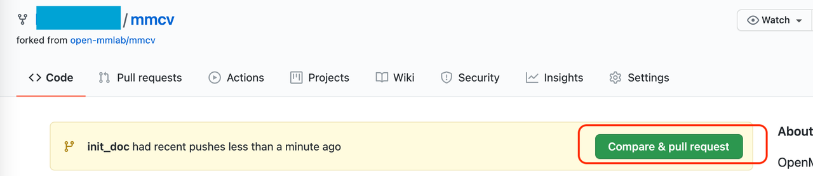

## 贡献代码

欢迎加入 MMCV 社区，我们致力于打造最前沿的计算机视觉的基础库，如果您是第一次参与开源活动，可以参考 [MMCV PR 全流程](<>)

### 贡献类型

欢迎任何类型的贡献，包括但不限于

#### 修复错误

代码或文档的拼写错误可以直接提交[拉取请求（Pull Request）](#%E6%8B%89%E5%8F%96%E8%AF%B7%E6%B1%82)

修复代码错误的步骤如下：

1. 如果提交的代码改动较大，建议先提交 issue，并正确描述 issue 的现象、原因和复现方式，讨论后确认修复方案
2. 提交拉取请求，并补充相应的单元测试，以确保修复代码的正确性

#### 文档补充

修复文档错误可以直接提交拉取请求

添加文档或将文档翻译成其他语言步骤如下

1. 提交 issue，确认添加文档的必要性
2. 提交拉取请求

#### 新增功能或组件

1. 如果新功能或模块涉及较大的代码改动，建议先提交 issue，确认功能的必要性。
2. 提交拉取请求，并添加新功能/组件的单元测试。

### 代码风格

#### Python

[PEP8](https://www.python.org/dev/peps/pep-0008/) 作为 OpenMMLab 算法库首选的代码规范，我们使用以下工具检查和格式化代码

- [flake8](https://github.com/PyCQA/flake8): Python 官方发布的代码规范检查工具，是多个检查工具的封装
- [isort](https://github.com/timothycrosley/isort): 自动调整模块导入顺序的工具
- [yapf](https://github.com/google/yapf): Google 发布的代码规范检查工具
- [codespell](https://github.com/codespell-project/codespell): 检查单词拼写是否有误
- [mdformat](https://github.com/executablebooks/mdformat): 检查 markdown 文件的工具
- [docformatter](https://github.com/myint/docformatter): 格式化 docstring 的工具

yapf 和 isort 的配置可以在 [setup.cfg](./setup.cfg) 找到

通过配置 [pre-commit hook](https://pre-commit.com/) ，我们可以在提交代码时自动检查和格式化 `flake8`、`yapf`、`isort`、`trailing whitespaces`、`markdown files`，
修复 `end-of-files`、`double-quoted-strings`、`python-encoding-pragma`、`mixed-line-ending`，调整 `requirments.txt` 的包顺序。
pre-commit 钩子的配置可以在 [.pre-commit-config](./.pre-commit-config.yaml) 找到。

pre-commit 具体的安装使用方式见[拉取请求](#%E6%8B%89%E5%8F%96%E8%AF%B7%E6%B1%82)。

#### C++ and CUDA

C++ 和 CUDA 的代码规范遵从 [Google C++ Style Guide](https://google.github.io/styleguide/cppguide.html)

### 拉取请求

#### 1.复刻仓库

当你第一次提交拉取请求时，先复刻 OpenMMLab 原代码库，点击 GitHub 页面右上角的 **Fork** 按钮即可


将代码克隆到本地

```shell
git clone https://github.com/{username}/mmcv.git
```

添加原代码库为上游代码库

```bash
git remote add upstream git@github.com:open-mmlab/mmcv
```

建议每次提交拉取请求之前，先检出到 master 分支，将最新的远程代码更新到本地。

```bash
git checkout master
git pull upstream master
```

开发过程中, 如果 `master` 分支更新导致和开发分支出现冲突，建议使用 `rebase` 解决冲突

```shell
git rebase master
# follow git instructions to resolve conflicts
git push -f
```

#### 2. 创建开发分支

建议的分支命名规则 `username/pr_name`

```shell
git checkout -b username/refactor_contributing_doc
```

#### 3. 第一次配置 pre-commit

3.1. 在本地仓库中执行

```shell
pip install -U pre-commit
pre-commit install
```

3.2. 此后第一次提交代码时，会自动安装代码风格检查的依赖库：


如果本地网络状态不佳，可能会导致代码检查的三方库安装失败，建议重复执行 `git commit -m xxx`，继续下载三方库，或者让
git 走代理。初始化完 pre-commit 后，提交会继续进行。如果提交的代码不符合代码风格规范，pre-commit 会发出警告，并自动修复部分错误。


修改后提交符合规范的代码


3.3. 如果你想临时提交一些内容，并绕开 pre-commit 的检查

```shell
git commit -m "xxx" --no-verify
```

#### 4. 确认提交代码能够在本地通过单元测试，以修复 runner 为例

```shell
pytest tests/test_runner/test_runner.py
```

#### 5. 提交代码，确认代码能够通过 pre-commit

新增模块或修改函数接口时，需要补充参数的 Type Hints 和 docstring，具体规则参考 Type Hints 教程
https://zhuanlan.zhihu.com/p/519335398%E3%80%82

#### 6. 提交拉取请求

6.1. 创建拉取请求 
修改`拉取请求`信息模板，描述修改原因和修改内容。还可以在 PR 描述中，手动关联到相关的`议题` (issue),（更多细节，请参考\[官方文档\]
(https://docs.github.com/en/issues/tracking-your-work-with-issues/linking-a-pull-request-to-an-issue)）。

6.2. 如果是第一次提交拉取请求，需要签名 CLA，并确认本地的 git 邮箱和


6.3. 检查 是否通过 CI/CD


可以点击 Details 查看具体的错误信息

### 指引

- 单元测试

  在提交修复代码错误或新增特性的拉取请求时，我们应该尽可能的让单元测试覆盖所有提交的代码，计算单元测试覆盖率的方法如下

  ```shell
  python -m coverage run -m pytest /path/to/test_file
  python -m coverage html
  # check file in htmlcov/index.html
  ```

- 文档渲染

  在提交修复代码错误或新增特性的拉取请求时，可能会需要修改/新增模块的 docstring。我们需要确认渲染后的文档样式是正确的。
  本地生成渲染后的文档的方法如下

  ```shell
  pip install -r requirements/docs.txt
  cd cd docs/zh_cn/
  # or docs/en
  make html
  # check file in ./docs/zh_cn/_build/html/index.html
  ```

### 拉取请求规范

1. 使用 [pre-commit hook](https://pre-commit.com)，尽量减少代码风格相关问题

2. 一个`拉取请求`对应一个短期分支

3. 粒度要细，一个`拉取请求`只做一件事情，避免超大的`拉取请求`

   - Bad：实现 Faster R-CNN
   - Acceptable：给 Faster R-CNN 添加一个 box head
   - Good：给 box head 增加一个参数来支持自定义的 conv 层数

4. 每次 Commit 时需要提供清晰且有意义 commit 信息

5. 提供清晰且有意义的`拉取请求`描述

   - 标题写明白任务名称，一般格式:\[Prefix\] Short description of the pull request (Suffix)
   - prefix: 新增功能 \[Feature\], 修 bug \[Fix\], 文档相关 \[Docs\], 开发中 \[WIP\] (暂时不会被review)
   - 描述里介绍`拉取请求`的主要修改内容，结果，以及对其他部分的影响, 参考`拉取请求`模板
   - 关联相关的`议题` (issue) 和其他`拉取请求`

6. 如果引入了其他三方库，或借鉴了三方库的代码，请确认他们的许可证和 mmcv 兼容，并在借鉴的代码上补充 `This code is inspired from http://`
