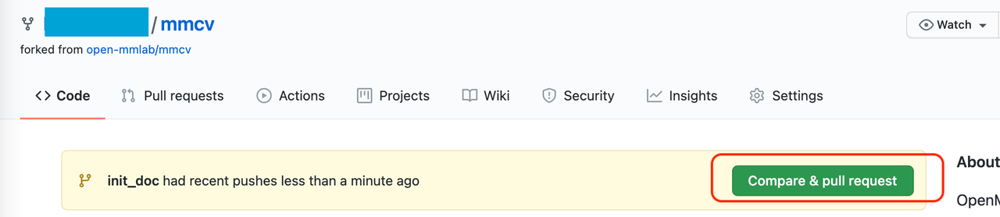

## 拉取请求

### 什么是拉取请求？

`拉取请求` (Pull Request), [GitHub 官方文档](https://docs.github.com/en/github/collaborating-with-pull-requests/proposing-changes-to-your-work-with-pull-requests/about-pull-requests)定义如下。

```
拉取请求是一种通知机制。你修改了他人的代码，将你的修改通知原来作者，希望他合并你的修改。
```

### 基本的工作流：

1. 获取最新的代码库
2. 从主分支创建最新的分支进行开发
3. 提交修改
4. 推送你的修改并创建一个 `拉取请求`
5. 讨论、审核代码
6. 将开发分支合并到主分支

### 具体步骤

#### 1. 获取最新的代码库

- 当你第一次提 PR 时

  复刻 OpenMMLab 原代码库，点击 GitHub 页面右上角的 **Fork** 按钮即可
  

  克隆复刻的代码库到本地

  ```bash
  git clone git@github.com:XXX/mmcv.git
  ```

  添加原代码库为上游代码库

  ```bash
  git remote add upstream git@github.com:open-mmlab/mmcv
  ```

- 从第二个 PR 起

  检出本地代码库的主分支，然后从最新的原代码库的主分支拉取更新

  ```bash
  git checkout master
  git pull upstream master
  ```

#### 2. 从主分支创建一个新的开发分支

```bash
git checkout -b branchname
```

```{tip}
为了保证提交历史清晰可读，我们强烈推荐您先检出主分支 (master)，再创建新的分支。
```

#### 3. 提交你的修改

```bash
# coding
git add [files]
git commit -m 'messages'
```

#### 4. 推送你的修改到复刻的代码库，并创建一个`拉取请求`

- 推送当前分支到远端复刻的代码库

  ```bash
  git push origin branchname
  ```

- 创建一个`拉取请求`
  

- 修改`拉取请求`信息模板，描述修改原因和修改内容。还可以在 PR 描述中，手动关联到相关的`议题` (issue),（更多细节，请参考[官方文档](https://docs.github.com/en/issues/tracking-your-work-with-issues/linking-a-pull-request-to-an-issue)）。

#### 5. 讨论并评审你的代码

- 创建`拉取请求`时，可以关联给相关人员进行评审
  

- 根据评审人员的意见修改代码，并推送修改

#### 6. `拉取请求`合并之后删除该分支

```bash
git branch -d branchname # delete local branch
git push origin --delete branchname # delete remote branch
```

### PR 规范

1. 使用 [pre-commit hook](https://pre-commit.com)，尽量减少代码风格相关问题

2. 一个 PR 对应一个短期分支

3. 粒度要细，一个PR只做一件事情，避免超大的PR

   - Bad：实现 Faster R-CNN
   - Acceptable：给 Faster R-CNN 添加一个 box head
   - Good：给 box head 增加一个参数来支持自定义的 conv 层数

4. 每次 Commit 时需要提供清晰且有意义 commit 信息

5. 提供清晰且有意义的`拉取请求`描述

   - 标题写明白任务名称，一般格式:\[Prefix\] Short description of the pull request (Suffix)
   - prefix: 新增功能 \[Feature\], 修 bug \[Fix\], 文档相关 \[Docs\], 开发中 \[WIP\] (暂时不会被review)
   - 描述里介绍`拉取请求`的主要修改内容，结果，以及对其他部分的影响, 参考`拉取请求`模板
   - 关联相关的`议题` (issue) 和其他`拉取请求`
