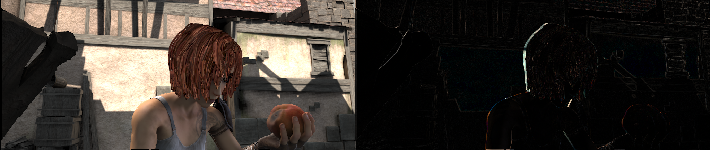

## 数据处理

### 图像

图像模块提供了一些图像预处理的函数，该模块依赖 `opencv` 。

#### 读取/保存/显示

使用 `imread` 和 `imwrite` 函数可以读取和保存图像。

```python
import mmcv

img = mmcv.imread('test.jpg')
img = mmcv.imread('test.jpg', flag='grayscale')
img_ = mmcv.imread(img)  # 相当于什么也没做
mmcv.imwrite(img, 'out.jpg')
```

从二进制中读取图像

```python
with open('test.jpg', 'rb') as f:
    data = f.read()
img = mmcv.imfrombytes(data)
```

显示图像文件或已读取的图像

```python
mmcv.imshow('tests/data/color.jpg')

for i in range(10):
    img = np.random.randint(256, size=(100, 100, 3), dtype=np.uint8)
    mmcv.imshow(img, win_name='test image', wait_time=200)
```

#### 色彩空间转换

支持的转换函数：

- bgr2gray
- gray2bgr
- bgr2rgb
- rgb2bgr
- bgr2hsv
- hsv2bgr

```python
img = mmcv.imread('tests/data/color.jpg')
img1 = mmcv.bgr2rgb(img)
img2 = mmcv.rgb2gray(img1)
img3 = mmcv.bgr2hsv(img)
```

#### 缩放

有三种缩放图像的方法。所有以 `imresize_*` 开头的函数都有一个 `return_scale` 参数，如果
该参数为 `False` ，函数的返回值只有调整之后的图像，否则是一个元组 `(resized_img, scale)` 。

```python
# 缩放图像至给定的尺寸
mmcv.imresize(img, (1000, 600), return_scale=True)

# 缩放图像至与给定的图像同样的尺寸
mmcv.imresize_like(img, dst_img, return_scale=False)

# 以一定的比例缩放图像
mmcv.imrescale(img, 0.5)

# 缩放图像至最长的边不大于1000、最短的边不大于800并且没有改变图像的长宽比
mmcv.imrescale(img, (1000, 800))
```

#### 旋转

我们可以使用 `imrotate` 旋转图像一定的角度。旋转的中心需要指定，默认值是原始图像的中心。有
两种旋转的模式，一种保持图像的尺寸不变，因此旋转后原始图像中的某些部分会被裁剪，另一种是扩大
图像的尺寸进而保留完整的原始图像。

```python
img = mmcv.imread('tests/data/color.jpg')

# 顺时针旋转图像30度
img_ = mmcv.imrotate(img, 30)

# 逆时针旋转图像90度
img_ = mmcv.imrotate(img, -90)

# 顺时针旋转图像30度并且缩放图像为原始图像的1.5倍
img_ = mmcv.imrotate(img, 30, scale=1.5)

# 以坐标(100, 100)为中心顺时针旋转图像30度
img_ = mmcv.imrotate(img, 30, center=(100, 100))

# 顺时针旋转图像30度并扩大图像的尺寸
img_ = mmcv.imrotate(img, 30, auto_bound=True)
```

#### 翻转

我们可以使用 `imflip` 翻转图像。

```python
img = mmcv.imread('tests/data/color.jpg')

# 水平翻转图像
mmcv.imflip(img)

# 垂直翻转图像
mmcv.imflip(img, direction='vertical')
```

#### 裁剪

`imcrop` 可以裁剪图像的一个或多个区域，每个区域用左上角和右下角坐标表示，形如(x1, y1, x2, y2)

```python
import mmcv
import numpy as np

img = mmcv.imread('tests/data/color.jpg')

# 裁剪区域 (10, 10, 100, 120)
bboxes = np.array([10, 10, 100, 120])
patch = mmcv.imcrop(img, bboxes)

# 裁剪两个区域，分别是 (10, 10, 100, 120) 和 (0, 0, 50, 50)
bboxes = np.array([[10, 10, 100, 120], [0, 0, 50, 50]])
patches = mmcv.imcrop(img, bboxes)

# 裁剪两个区域并且缩放区域1.2倍
patches = mmcv.imcrop(img, bboxes, scale=1.2)
```

#### 填充

`impad` and `impad_to_multiple` 可以用给定的值将图像填充至给定的尺寸。

```python
img = mmcv.imread('tests/data/color.jpg')

# 用给定值将图像填充至 (1000, 1200)
img_ = mmcv.impad(img, shape=(1000, 1200), pad_val=0)

# 用给定值分别填充图像的3个通道至 (1000, 1200)
img_ = mmcv.impad(img, shape=(1000, 1200), pad_val=(100, 50, 200))

# 用给定值填充图像的左、右、上、下四条边
img_ = mmcv.impad(img, padding=(10, 20, 30, 40), pad_val=0)

# 用3个值分别填充图像的左、右、上、下四条边的3个通道
img_ = mmcv.impad(img, padding=(10, 20, 30, 40), pad_val=(100, 50, 200))

# 将图像的四条边填充至能够被给定值整除
img_ = mmcv.impad_to_multiple(img, 32)
```

### 视频

视频模块提供了以下的功能：

- 一个 `VideoReader` 类，具有友好的 API 接口可以读取和转换视频
- 一些编辑视频的方法，包括 `cut` ， `concat` ， `resize`
- 光流的读取/保存/变换

#### VideoReader

`VideoReader` 类提供了和序列一样的接口去获取视频帧。该类会缓存所有被访问过的帧。

```python
video = mmcv.VideoReader('test.mp4')

# 获取基本的信息
print(len(video))
print(video.width, video.height, video.resolution, video.fps)

# 遍历所有的帧
for frame in video:
    print(frame.shape)

# 读取下一帧
img = video.read()

# 使用索引获取帧
img = video[100]

# 获取指定范围的帧
img = video[5:10]
```

将视频切成帧并保存至给定目录或者从给定目录中生成视频。

```python
# 将视频切成帧并保存至目录
video = mmcv.VideoReader('test.mp4')
video.cvt2frames('out_dir')

# 从给定目录中生成视频
mmcv.frames2video('out_dir', 'test.avi')
```

#### 编辑函数

有几个用于编辑视频的函数，这些函数是对 `ffmpeg` 的封装。

```python
# 裁剪视频
mmcv.cut_video('test.mp4', 'clip1.mp4', start=3, end=10, vcodec='h264')

# 将多个视频拼接成一个视频
mmcv.concat_video(['clip1.mp4', 'clip2.mp4'], 'joined.mp4', log_level='quiet')

# 将视频缩放至给定的尺寸
mmcv.resize_video('test.mp4', 'resized1.mp4', (360, 240))

# 将视频缩放至给定的倍率
mmcv.resize_video('test.mp4', 'resized2.mp4', ratio=2)
```

#### 光流

`mmcv` 提供了以下用于操作光流的函数：

- 读取/保存
- 可视化
- 流变换

我们提供了两种将光流dump到文件的方法，分别是非压缩和压缩的方法。非压缩的方法直接将浮点数值的光流
保存至二进制文件，虽然光流无损但文件会比较大。而压缩的方法先量化光流至 0-255 整形数值再保存为
jpeg图像。光流的x维度和y维度会被拼接到图像中。

1. 读取/保存

```python
flow = np.random.rand(800, 600, 2).astype(np.float32)
# 保存光流到flo文件 (~3.7M)
mmcv.flowwrite(flow, 'uncompressed.flo')
# 保存光流为jpeg图像 (~230K)，图像的尺寸为 (800, 1200)
mmcv.flowwrite(flow, 'compressed.jpg', quantize=True, concat_axis=1)

# 读取光流文件，以下两种方式读取的光流尺寸均为 (800, 600, 2)
flow = mmcv.flowread('uncompressed.flo')
flow = mmcv.flowread('compressed.jpg', quantize=True, concat_axis=1)
```

2. 可视化

使用 `mmcv.flowshow()` 可视化光流

```python
mmcv.flowshow(flow)
```


1. 流变换

```python
img1 = mmcv.imread('img1.jpg')
flow = mmcv.flowread('flow.flo')
warpped_img2 = mmcv.flow_warp(img1, flow)
```

img1 (左) and img2 (右)


光流 (img2 -> img1)


变换后的图像和真实图像的差异


