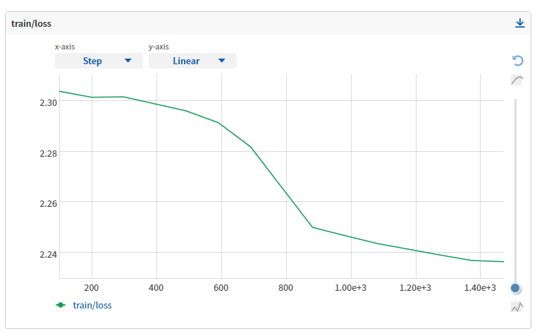

## 钩子

### 钩子是什么

#### 钩子介绍
```
钩子编程（hooking），也称作“挂钩”，是计算机程序设计术语，指通过拦截软件模块间的函数调用、消息传递、事件传递来修改或扩展操作系统、应用程序或其他软件组件的行为的各种技术。处理被拦截的函数调用、事件、消息的代码，被称为钩子（hook）。--维基百科
```

在训练过程中，通常有十个关键位点，如下图所示，从训练开始到结束，所有关键位点已用红色标出，共有 10 个。我们可以在这十个位点插入各种逻辑，例如加载模型权重、保存模型权重。而我们将同一类型的逻辑组织成一个 Hook。因此，MMCV 中 Hook 的作用就是训练和验证模型时，在不改变其他代码的前提下，灵活地在不同位点插入定制化的逻辑。


而控制整个训练过程的抽象在 MMCV 中被设计为 Runner，它的主要行为就是执行上图蓝色的工作流，MMCV 提供了两种类型的 Runner，一种是以 epoch 为单位迭代的 [EpochBasedRunner](https://github.com/open-mmlab/mmcv/blob/master/mmcv/runner/epoch_based_runner.py)，另一种是以 iteration 为单位迭代的 [IterBasedRunner](https://github.com/open-mmlab/mmcv/blob/master/mmcv/runner/iter_based_runner.py)。下面给出 EpochBasedRunner 和 IterBasedRunner 在十个位点调用 Hook 对应方法的代码。

```python
class EpochBasedRunner(BaseRunner):
    def run(self, data_loaders, workflow, max_epochs=None, **kwargs):
        # 开始运行时调用
        self.call_hook('before_run')

        while self.epoch < self._max_epochs:
            # 开始 epoch 迭代前调用
            self.call_hook('before_train_epoch')
            for i, data_batch in enumerate(self.train_dataloader):
                # 开始 iter 迭代前调用
                self.call_hook('before_train_iter')
                # model forward
                # 经过一次迭代后调用
                self.call_hook('after_train_iter')
            # 经过一个 epoch 迭代后调用
            self.call_hook('after_train_epoch')
            # 开始验证 epoch 迭代前调用
            self.call_hook('before_val_epoch')
            for i, data_batch in enumerate(self.val_dataloader):
                # 开始 iter 迭代前调用
                self.call_hook('before_val_iter')
                # model forward
                # 经过一次迭代后调用
                self.call_hook('after_val_iter')
            # 经过一个 epoch 迭代后调用
            self.call_hook('after_val_epoch')

        # 运行完成前调用
        self.call_hook('after_run')


class IterbasedRunner(BaseRunner):
    def run(self, data_loaders, workflow, max_iters=None, **kwargs):
        # 开始运行时调用
        self.call_hook('before_run')
        iter_loaders = [IterLoader(x) for x in data_loaders]
        # 开始 epoch 迭代前调用
        # 注意：IterBaseRunner 只会调用一次 before_epoch 的位点
        self.call_hook('before_epoch')

        while self.iter < self._max_iters:
            # 开始训练 iter 迭代前调用
            self.call_hook('before_train_iter')
            # model forward
            # 经过一次训练迭代后调用
            self.call_hook('after_train_iter')

            # 开始验证 iter 迭代前调用
            self.call_hook('before_val_iter')
            # model forward
            # 经过一次验证迭代后调用
            self.call_hook('after_val_iter')

        # 经过一个 epoch 迭代后调用
        self.call_hook('after_epoch')
        # 运行完成前调用
        self.call_hook('after_run')
```

我们以 [CheckpointHook](https://github.com/open-mmlab/mmcv/blob/master/mmcv/runner/hooks/checkpoint.py) 为例简单介绍一下位点对应的方法。注意：并不是每个位点都需要实现对应的方法。

```python
class CheckpointHook(Hook):
    """保存 checkpoint"""
    def __init__(self,
                 interval=-1,
                 by_epoch=True,
                 save_optimizer=True,
                 out_dir=None,
                 max_keep_ckpts=-1,
                 save_last=True,
                 sync_buffer=False,
                 file_client_args=None,
                 **kwargs):
        # 参数初始化

    def before_run(self, runner):
        # 设置 out_dir 和创建 FileClient 对象，
        # 其中 out_dir 是保存 checkpoint 的目录，
        # FileClient 对象作为统一接口调用不同的文件后端操作 checkpoint，
        # 在 CheckpointHook 中主要涉及保存 checkpoint 和删除 checkpoint
        # 的操作

    def after_train_epoch(self, runner):
        # 处理 by_epoch 为 True 的情况
        # 判断是否需要同步 buffer 参数以及
        # 调用 _save_checkpoint 保存 checkpoint。

    @master_only
    def _save_checkpoint(self, runner):
        # 保存 checkpoint 并且删除不想要的 checkpoint，
        # 不想要的 checkpoint 是指假设我们只想保存最近的 5 个 checkpoint，
        # 那么我们需要在第 6 个 checkpoint 生成的时候
        # 删除第 1 个 checkpoint，可以通过设置 max_keep_ckpts
        # 实现该功能

    def after_train_iter(self, runner):
        # 处理 by_epoch 为 Fasle 的情况
        # 判断是否需要同步 buffer 参数以及
        # 调用 _save_checkpoint 保存 checkpoint
```

#### 钩子列表

MMCV 提供了很多 Hook，每个 Hook 都有对应的优先级，在 Runner 训练过程中，同一位点，不同 Hook 的调用顺序是按它们的优先级所定义的，优先级越高，越早被调用。如果优先级一样，被调用的顺序和 Hook 注册的顺序一致。

我们将 MMCV 提供的 Hook 分为两类，一类是默认 Hook，另一类是定制 Hook。前者表示当我们调用 Runner 的 register_training_hooks 方法时被默认注册（注意，我们同样需要提供配置），后者表示需要手动注册，这里的手动有两种方式，一种是调用 Runner 的 register_hook 注册，另一种在调用 register_training_hooks 时传入 custom_hooks_config 参数。

```{note}
不建议修改 MMCV 默认 Hook 的优先级，除非您有特殊需求。另外，定制 Hook 的优先级默认为 Normal（50）
```

##### 默认钩子

<table class="docutils">
  <tbody>
    <tr>
      <td align="left">名称</td>
      <td align="left">用途</td>
      <td align="left">优先级</td>
      <td align="left">API 文档</td>
    </tr>
    <tr>
      <td align="left">LrUpdaterHook</td>
      <td align="left">学习率调整</td>
      <td align="left">VERY_HIGH (10)</td>
      <td align="left"><a href="https://mmcv.readthedocs.io/en/latest/api.html#mmcv.runner.LrUpdaterHook">mmmcv.runner.LrUpdaterHook</a></td>
    </tr>
    <tr>
      <td align="left">MomentumUpdaterHook</td>
      <td align="left">动量更新</td>
      <td align="left">HIGH (30)</td>
      <td align="left"><a href="https://github.com/open-mmlab/mmcv/blob/master/mmcv/runner/hooks/momentum_updater.py">mmcv/runner/hooks/momentum_updater.py</a></td>
    </tr>
    <tr>
      <td align="left">OptimizerHook</td>
      <td align="left">反向传播以及参数更新</td>
      <td align="left">ABOVE_NORMAL (40)</td>
      <td align="left"><a href="https://mmcv.readthedocs.io/en/latest/api.html#mmcv.runner.OptimizerHook">mmmcv.runner.OptimizerHook</a></td>
    </tr>
    <tr>
      <td align="left">CheckPointHook</td>
      <td align="left">按指定间隔保存权重</td>
      <td align="left">NORMAL (50)</td>
      <td align="left"><a href="https://mmcv.readthedocs.io/en/latest/api.html#mmcv.runner.CheckPointHook">mmmcv.runner.CheckPointHook</a></td>
    </tr>
    <tr>
      <td align="left">IterTimerHook</td>
      <td align="left">统计迭代耗时</td>
      <td align="left">LOW (70)</td>
      <td align="left"><a href="https://github.com/open-mmlab/mmcv/blob/master/mmcv/runner/hooks/iter_timer.py">mmcv/runner/hooks/iter_timer.py</a></td>
    </tr>
    <tr>
      <td align="left">LoggerHook</td>
      <td align="left">记录日志</td>
      <td align="left">LOW (90)</td>
      <td align="left"><a href="https://mmcv.readthedocs.io/en/latest/api.html#mmcv.runner.LoggerHook">mmcv.runner.LoggerHook</a></td>
    </tr>
  </tbody>
</table>

##### 定制钩子

<table class="docutils">
  <tbody>
    <tr>
      <td align="left">名称</td>
      <td align="left">用途</td>
      <td align="left">优先级</td>
      <td align="left">API 文档</td>
    </tr>
    <tr>
      <td align="left">DistSamplerSeedHook</td>
      <td align="left">确保 shuffle 生效</td>
      <td align="left">NORMAL (50)</td>
      <td align="left"><a href="https://mmcv.readthedocs.io/en/latest/api.html#mmcv.runner.DistSamplerSeedHook">mmcv.runner.DistSamplerSeedHook</a></td>
    </tr>
    <tr>
      <td align="left">EvalHook</td>
      <td align="left">按指定间隔测试验证集</td>
      <td align="left">NORMAL (50)</td>
      <td align="left"><a href="https://mmcv.readthedocs.io/en/latest/api.html#mmcv.runner.EvalHook">mmcv.runner.EvalHook</a></td>
    </tr>
    <tr>
      <td align="left">EmptyCacheHook</td>
      <td align="left">PyTorch CUDA 缓存清理</td>
      <td align="left">NORMAL (50)</td>
      <td align="left"><a href="https://mmcv.readthedocs.io/en/latest/api.html#mmcv.runner.EmptyCacheHook">mmmcv.runner.EmptyCacheHook</a></td>
    </tr>
    <tr>
      <td align="left">ProfilerHook</td>
      <td align="left">分析训练时间的瓶颈</td>
      <td align="left">NORMAL (50)</td>
      <td align="left"><a href="https://mmcv.readthedocs.io/en/latest/api.html#mmcv.runner.ProfilerHook">mmcv.runner.ProfilerHook</a></td>
    </tr>
    <tr>
      <td align="left">SyncBuffersHook</td>
      <td align="left">同步模型的 buffer</td>
      <td align="left">NORMAL (50)</td>
      <td align="left"><a href="https://mmcv.readthedocs.io/en/latest/api.html#mmcv.runner.SyncBuffersHook">mmcv.runner.SyncBuffersHook</a></td>
    </tr>
  </tbody>
</table>

### 钩子用法介绍

#### EvalHook

[EvalHook](https://github.com/open-mmlab/mmcv/blob/master/mmcv/runner/hooks/evaluation.py) 按照一定的间隔对模型进行验证，在 EvalHook 出现之前，MMCV 对验证的支持是通过设置 workflow，形如 `workflow=[('train', 2), ('val', 1)]`，表示每训练 2 个 epoch（假设使用的 Runner 是 EpochBasedRunner）验证一次。但这种方式灵活度不够，例如不能保存最优的模型。

于是，我们设计了 EvalHook。EvalHook 除了能很好地解决不能保存最优模型的问题，还提供了其他功能，例如支持从指定 epoch 才开始验证模型（因为前面的 epoch 模型效果较差，可以不验证从而节省时间）、支持恢复训练的时候先验证再训练（例如加载模型后想查看 checkpoint 的性能）。

MMCV 除了提供 EvalHook，还提供了 [DistEvalHook](https://github.com/open-mmlab/mmcv/blob/master/mmcv/runner/hooks/evaluation.py)，其继承自 EvalHook，用于分布式环境下的验证。除了初始化参数有些不同，DistEvalHook 还有一个不同点是重载了 EvalHook 中的 `_do_evaluate` 方法。EvalHook 中的 `_do_evaluate` 方法主要执行测试并保存最优模型（如果该模型是当前最优）。而 DistEvalHook 中的 `_do_evaluate` 作用也是类似的，首先在进行测试前同步 BN 中的 buffer（为了保证各个进程的模型是一致的），然后进行分布式测试（即每个进程单独测试），最后 master 进程收集其他进程的测试结果。

```{note}
推荐使用 EvalHook 代替 workflow 中的 val
```

使用 EvalHook 只需两行代码，一行实例化 EvalHook ，另一个行将实例化的对象注册到 Runner。

##### 最简用法

```python
from mmcv.runner.hooks import EvalHook

val_dataloader = ...
runner = EpochBasedRunner(...)
runner.register_hook(EvalHook(val_dataloader))
```

##### 间隔 5 个 epoch 验证一次

```python
from mmcv.runner.hooks import EvalHook

val_dataloader = ...
runner = EpochBasedRunner(...)
runner.register_hook(EvalHook(val_dataloader, interval=5))
```

##### 恢复训练时先验证再训练

假设从第 5 个 epoch 恢复训练，将 start 设置小于等于 5 即可。

```python
from mmcv.runner.hooks import EvalHook

val_dataloader = ...
runner = EpochBasedRunner(...)
runner.register_hook(EvalHook(val_dataloader, start=5))
```

##### 保存最优的模型

通过设置 save_best='acc'，EvalHook 会根据 'acc' 来选择最优的模型。

```python
from mmcv.runner.hooks import EvalHook

val_dataloader = ...
runner = EpochBasedRunner(...)
runner.register_hook(EvalHook(val_dataloader, save_best='acc'))
```

当然，也可以设置为 'auto'，那么会自动根据返回的验证结果中的第一个 key 作为选择最优模型的依据。

#### CheckPointHook

[CheckpointHook](https://github.com/open-mmlab/mmcv/blob/master/mmcv/runner/hooks/checkpoint.py) 主要是对模型参数进行保存，如果是分布式多卡训练，则仅仅会在 master 进程保存。另外，我们可以通过 `max_keep_ckpts` 参数设置最多保存多少个权重文件，权重文件数超过 `max_keep_ckpts` 时，前面的权重会被删除。

如果以 epoch 为单位进行保存，则该 Hook 实现 `after_train_epoch` 方法即可，否则仅需实现 `after_train_iter` 方法。

##### 最简用法

```python
checkpoint_config = {
    'interval': 5,  # 每训练 5 个 epoch 保存一次 checkpoint
}
runner = EpochBasedRunner(...)
runner.register_checkpoint_hook(checkpoint_config)
```

##### 保存最新的 n 个 权重

```python
checkpoint_config = {
    'interval': 5,  # 每训练 5 个 epoch 保存一次 checkpoint
    'max_keep_ckpts': 5,  # 只保留最新的 5 个 checkpoint
}
runner = EpochBasedRunner(...)
runner.register_checkpoint_hook(checkpoint_config)
```

##### 将权重保存至指定的路径

```python
checkpoint_config = {
    'interval': 5,  # 每训练 5 个 epoch 保存一次 checkpoint
    'out_dir': '/path/of/expected_directory',  # 保存至 /path/of/expected_directory
}
runner = EpochBasedRunner(...)
runner.register_checkpoint_hook(checkpoint_config)
```

##### 同步 buffer

考虑到分布式训练过程，如果有必要（例如分布式训练中没有使用同步 BN，而是普通 BN），则可以通过设置参数 `sync_buffer` 为 True，在保存权重前，会对模型 buffers（典型的例如 BN 的全局均值和方差参数）进行跨卡同步，让每张卡的 buffers 参数都相同，此时在 master 进程保存权重和 buffer，才是合理的。

```python
checkpoint_config = {
    'interval': 5,  # 每训练 5 个 epoch 保存一次 checkpoint
    'sync_buffer': True,  # 同步 buffer
}
runner = EpochBasedRunner(...)
runner.register_checkpoint_hook(checkpoint_config)
```

#### OptimizerHook

[OptimizerHook](https://github.com/open-mmlab/mmcv/blob/master/mmcv/runner/hooks/optimizer.py) 包含一些 optimizer 相关的操作

- 梯度清零 runner.optimizer.zero_grad()
- 反向传播 runner.output['loss'].backward()
- 梯度阶段 clip_grads（可选）
- 参数更新 runner.optimizer.step()

MMCV 还提供了 [Fp16OptimizerHook](https://github.com/open-mmlab/mmcv/blob/master/mmcv/runner/hooks/optimizer.py) 和 [GradientCumulativeOptimizerHook](https://github.com/open-mmlab/mmcv/blob/master/mmcv/runner/hooks/optimizer.py)，前者用于混合精度训练，后者用于梯度累计。


Fp16OptimizerHook 是混合精度训练在 MMCV 中的实现，主要逻辑如下

- 维护一个 FP32 数值精度模型的副本
- 在每个 iteration
  - 拷贝并且转换成 FP16 模型
  - 前向传播（FP16 的模型参数)，此时 weights, activations 都是 FP16
  - loss 乘 scale factor s
  - 反向传播（FP16 的模型参数和参数梯度)， 此时 gradients 也是 FP16
  - 参数梯度乘 1/s
  - 利用 FP16 的梯度更新 FP32 的模型参数

[GradientCumulativeOptimizerHook](https://github.com/open-mmlab/mmcv/blob/master/mmcv/runner/hooks/optimizer.py) 用于节省显存，即通过指定梯度累积的次数，实现反向传播多次才更新参数，常常用于显存不足但想用比较大的 batch size 训练模型。

##### 最简用法

```python
optimizer_config = dict(grad_clip=None)
runner = EpochBasedRunner(...)
runner.register_optimizer_hook(optimizer_config)
```

##### 梯度截断

用于避免梯度爆炸，grad_clip 的设置可参考 [clip_grad_norm_](https://pytorch.org/docs/stable/generated/torch.nn.utils.clip_grad_norm_.html)，具体使用案例可参考 [yolact_r50_8x8_coco.py](https://github.com/open-mmlab/mmdetection/blob/master/configs/yolact/yolact_r50_8x8_coco.py)。

```python
optimizer_config=dict(grad_clip=dict(max_norm=35, norm_type=2))
runner = EpochBasedRunner(...)
runner.register_optimizer_hook(optimizer_config)
```

##### 检测异常的模型参数

该设置会降低训练速度，故只应用于调试。该参数用于寻找不参与计算图的模型参数，不参与计算图的模型参数包括两种情况，一种是该模型参数没有参与前向计算，另一种参与了前向计算但没有参与 loss 的计算。

```python
optimizer_config = dict(grad_clip=None, detect_anomalous_params=True)
runner = EpochBasedRunner(...)
runner.register_optimizer_hook(optimizer_config)
```

##### 梯度累积

可用于显存不足的情况下训练训练更大的 batch size，更多细节可参考 https://github.com/open-mmlab/mmcv/pull/1221。

```python
optimizer_config = dict(type="GradientCumulativeOptimizerHook", cumulative_iters=4)
runner = EpochBasedRunner(...)
runner.register_optimizer_hook(optimizer_config)
```

```{warning}
切记不能同时使用 OptimizerHook 和 GradientCumulativeOptimizerHook，否则会遇到运行时错误: Trying to backward through the graph a second time，更多细节见 https://github.com/open-mmlab/mmcv/issues/1379
```

##### 混合精度训练

使用 MMCV 的 AMP 功能，只需遵循以下几个步骤：
1. 将 auto_fp16 装饰器应用到 model 的 forward 函数上
2. 设置模型的 fp16_enabled 为 True 表示开启 AMP 训练，否则不生效
3. 如果开启了 AMP，需要同时配置对应的 FP16 优化器配置 Fp16OptimizerHook
4. 在训练的不同时刻，调用 Fp16OptimizerHook，如果你同时使用了 MMCV 中的 Runner 模块，那么直接将第 3 步的参数输入到 Runner 中即可
5. (可选) 如果对应某些 OP 希望强制运行在 FP32 上，则可以在对应位置引入 force_fp32 装饰器

```python
# 1 作用到 forward 函数中
class ExampleModule(nn.Module):

    @auto_fp16()
    def forward(self, x, y):
        return x, y

# 2 如果开启 AMP，则需要加入开启标志
model.fp16_enabled = True

# 3 配置 Fp16OptimizerHook
optimizer_config = Fp16OptimizerHook(
    **cfg.optimizer_config, **fp16_cfg, distributed=distributed)

# 4 传递给 runner
runner.register_training_hooks(cfg.lr_config, optimizer_config,
                               cfg.checkpoint_config, cfg.log_config,
                               cfg.get('momentum_config', None))

# 5 可选
class ExampleModule(nn.Module):

    @auto_fp16()
    def forward(self, x, y):
        features=self._forward(x, y)
        loss=self._loss(features,labels)
        return loss

    def _forward(self, x, y):
       pass

    @force_fp32(apply_to=('features',))
    def _loss(features,labels) :
        pass
```

```{warning}
注意 force_fp32 要生效，依然需要 fp16_enabled 为 True
```

#### EMAHook

[EMAHook](https://github.com/open-mmlab/mmcv/blob/master/mmcv/runner/hooks/ema.py) 使用滑动平均策略对模型参数做平均以提高训练过程的稳定性。

```{tip}
需保证 EMAHook 的优先级高于 CheckpointHook
```

##### 最简用法

```python
ema_config = dict(type="EMAHook")
runner = EpochBasedRunner(...)
runner.register_hook(ema_config, priority='NORMAL')
```

##### 设置更新 ema 参数的间隔数

默认是每一次迭代之后都更新 ema 参数，我们可以通过 interval 设置间隔。

```python
ema_config = dict(type="EMAHook", interval=4)
runner = EpochBasedRunner(...)
runner.register_hook(ema_config, priority='NORMAL')
```

##### 恢复训练

当中断训练之后恢复训练，我们需要设置 resume_from 参数（注意，这个参数是一定要设置的，否则和不中断训练的结果是不一致的），这样我们就可以加载 ema 参数，以保证使用 EMAHook 训练的正确性。

```python
ema_config = dict(type="EMAHook", resume_from="/path/of/your/checkpoint.pth")
runner = EpochBasedRunner(...)
runner.register_hook(ema_config, priority='NORMAL')
```

#### LrUpdaterHook

学习率决定每次更新的步长，合适的学习率可以使训练快速收敛。MMCV 中提供很多学习率衰减策略，其中部分学习率更新策略也伴有动量更新策略。

下表是 MMCV 支持的学习率更新策略和对应的动量更新策略

<table class="docutils">
  <tbody>
    <tr>
      <td align="left" width="120">名称</td>
      <td align="left" style="min-width: 160px">描述</td>
      <td align="left" width="100">策略</td>
      <td align="left" width="240">API 文档</td>
    </tr>
    <tr>
      <td align="left">FixedLrUpdaterHook</td>
      <td align="left">固定学习率</td>
      <td align="left">fixed</td>
      <td align="left"><a href="https://mmcv.readthedocs.io/en/latest/api.html#mmcv.runner.FixedLrUpdaterHook">mmcv.runner.FixedLrUpdaterHook</a></td>
    </tr>
    <tr>
      <td align="left">StepLrUpdaterHook, StepMomentumUpdaterHook</td>
      <td align="left">等间隔调整学习率</td>
      <td align="left">step</td>
      <td align="left"><a href="https://mmcv.readthedocs.io/en/latest/api.html#mmcv.runner.StepLrUpdaterHook">mmcv.runner.StepLrUpdaterHook</a>, <a href="https://mmcv.readthedocs.io/en/latest/api.html#mmcv.runner.StepMomentumUpdaterHook">mmcv.runner.StepMomentumUpdaterHook</a></td>
    </tr>
    <tr>
      <td align="left">ExpLrUpdaterHook</td>
      <td align="left">指数调整学习率</td>
      <td align="left">exp</td>
      <td align="left"><a href="https://mmcv.readthedocs.io/en/latest/api.html#mmcv.runner.ExpLrUpdaterHook">mmcv.runner.ExpLrUpdaterHook</a></td>
    </tr>
    <tr>
      <td align="left">PolyLrUpdaterHook</td>
      <td align="left">多项式调整学习率</td>
      <td align="left">poly</td>
      <td align="left"><a href="https://mmcv.readthedocs.io/en/latest/api.html#mmcv.runner.PolyLrUpdaterHook">mmcv.runner.PolyLrUpdaterHook</a></td>
    </tr>
    <tr>
      <td align="left">InvLrUpdaterHook</td>
      <td align="left">反比例调整学习率</td>
      <td align="left">Inv</td>
      <td align="left"><a href="https://mmcv.readthedocs.io/en/latest/api.html#mmcv.runner.InvLrUpdaterHook">mmcv.runner.InvLrUpdaterHook</a></td>
    </tr>
    <tr>
      <td align="left">CosineAnnealingLrUpdaterHook, CosineAnnealingMomentumUpdaterHook</td>
      <td align="left">余弦退火调整学习率</td>
      <td align="left">CosineAnnealing</td>
      <td align="left"><a href="https://mmcv.readthedocs.io/en/latest/api.html#mmcv.runner.CosineAnnealingLrUpdaterHook">mmcv.runner.CosineAnnealingLrUpdaterHook</a></td>
    </tr>
    <tr>
      <td align="left">FlatCosineAnnealingLrUpdaterHook</td>
      <td align="left">初始学习率训练一段时间再使用余弦退火调整学习率</td>
      <td align="left">FlatCosineAnnealing</td>
      <td align="left"><a href="https://mmcv.readthedocs.io/en/latest/api.html#mmcv.runner.FlatCosineAnnealingLrUpdaterHook">mmcv.runner.FlatCosineAnnealingLrUpdaterHook</a></td>
    </tr>
    <tr>
      <td align="left">CosineRestartLrUpdaterHook</td>
      <td align="left">多次余弦退火调整学习率</td>
      <td align="left">CosineRestart</td>
      <td align="left"><a href="https://mmcv.readthedocs.io/en/latest/api.html#mmcv.runner.CosineRestartLrUpdaterHook">mmcv.runner.CosineRestartLrUpdaterHook</a></td>
    </tr>
    <tr>
      <td align="left">CyclicLrUpdaterHook, CyclicMomentumUpdaterHook</td>
      <td align="left">循环调整学习率</td>
      <td align="left">cyclic</td>
      <td align="left"><a href="https://mmcv.readthedocs.io/en/latest/api.html#mmcv.runner.CyclicLrUpdaterHook">mmcv.runner.CyclicLrUpdaterHook</a>, <a href="https://mmcv.readthedocs.io/en/latest/api.html#mmcv.runner.CyclicMomentumUpdaterHook">mmcv.runner.CyclicMomentumUpdaterHook</a></td>
    </tr>
    <tr>
      <td align="left">OneCycleLrUpdaterHook, OneCycleMomentumUpdaterHook</td>
      <td align="left">一个循环内调整学习率，学习率先增大再减小</td>
      <td align="left">OneCycle</td>
      <td align="left"><a href="https://mmcv.readthedocs.io/en/latest/api.html#mmcv.runner.OneCycleLrUpdaterHook">mmcv.runner.OneCycleLrUpdaterHook</a>, <a href="https://mmcv.readthedocs.io/en/latest/api.html#mmcv.runner.OneCycleMomentumUpdaterHook">mmcv.runner.OneCycleMomentumUpdaterHook</a></td>
    </tr>
  </tbody>
</table>

学习率调整策略虽然有很多种，但用法如出一辙，下面只举两个常用的用法。

:::{tip}
为了确保学习率的衰减符合期望，我们可以参考 [可视化学习率脚本](https://mmclassification.readthedocs.io/en/latest/tools/visualization.html#learning-rate-schedule-visualization) 在开始训练前可视化学习率的变化。
:::

##### 等间隔调整学习率

```python
lr_config = dict(
    policy='step',  # 对应 StepLrUpdaterHook
    step=[16, 19])
runner = EpochBasedRunner(...)
runner.register_lr_hook(lr_config)
```

##### 余弦退火调整学习率

```python
lr_config = dict(
    policy='CosineAnnealing',  # 对应 CosineAnnealingLrUpdaterHook
    min_lr=0.01,
    )
runner = EpochBasedRunner(...)
runner.register_lr_hook(lr_config)
```

#### LoggerHook

MMCV 提供以下日志相关的 LoggerHook

<table class="docutils">
  <tbody>
    <tr>
      <td align="left">名称</td>
      <td align="left">API 文档</td>
    </tr>
    <tr>
      <td align="left">TextLoggerHook</td>
      <td align="left"><a href="https://mmcv.readthedocs.io/en/latest/api.html#mmcv.runner.TextLoggerHook">mmcv.runner.TextLoggerHook</a></td>
    </tr>
    <tr>
      <td align="left">TensorboardLoggerHook</td>
      <td align="left"><a href="https://mmcv.readthedocs.io/en/latest/api.html#mmcv.runner.TensorboardLoggerHook">mmcv.runner.TensorboardLoggerHook</a></td>
    </tr>
    <tr>
      <td align="left">NeptuneLoggerHook</td>
      <td align="left"><a href="https://mmcv.readthedocs.io/en/latest/api.html#mmcv.runner.NeptuneLoggerHook">mmcv.runner.NeptuneLoggerHook</a></td>
    </tr>
    <tr>
      <td align="left">DvcliveLoggerHook</td>
      <td align="left"><a href="https://mmcv.readthedocs.io/en/latest/api.html#mmcv.runner.DvcliveLoggerHook">mmcv.runner.DvcliveLoggerHook</a></td>
    </tr>
    <tr>
      <td align="left">WandbLoggerHook</td>
      <td align="left"><a href="https://mmcv.readthedocs.io/en/latest/api.html#mmcv.runner.WandbLoggerHook">mmcv.runner.WandbLoggerHook</a></td>
    </tr>
    <tr>
      <td align="left">MlflowLoggerHook</td>
      <td align="left"><a href="https://mmcv.readthedocs.io/en/latest/api.html#mmcv.runner.MlflowLoggerHook">mmcv.runner.MlflowLoggerHook</a></td>
    </tr>
  </tbody>
</table>

面对这么多 LoggerHook，我们该如何选择合适的日志 Hook 呢？以下是我们的一些推荐：

- 如果你偏好在本地使用，想要一款能满足基本的实验记录需求、且上手容易的，推荐使用 TensorBoard
- 如果对可视化和实验记录有较高要求，推荐使用 Neptune 和 WandB 。两者的实验记录功能都非常强大，并且都支持多人协作，适合大型项目的管理
- 如果你是开源项目的爱好者，或者你希望记录完整的 ML 实验全过程，MLflow 是一个不错的选择
- 如果你只需要记录基本的实验数据，但是对于大规模数据的版本管理有比较高的需求，那么推荐你使用 DVC

事实上，只要你喜欢，你可以同时使用的所有 LoggerHook。

```{note}
MMCV 目前提供的 LoggerHook 功能有限，只用于记录标量数据，例如 loss、acc 等，暂不支持可视化图像或特征图等。欢迎提 PR 完善 LoggerHook。
```

##### 输出到文件

[TextLoggerHook](https://github.com/open-mmlab/mmcv/blob/master/mmcv/runner/hooks/logger/text.py) 会将日志打印到终端以及保存到 json 文件。

+ 间隔 100 个 iteration 打印一次日志

```python
log_config = {
    'interval': 100,
    'hooks': [
        {
            'type': 'TextLoggerHook',
        },
     ]
}
runner = EpochBasedRunner(...)
runner.register_logger_hooks(log_config)
```

+ 训练完成后将日志拷贝至指定路径

```python
log_config = {
    'hooks': [
        {
            'type': 'TextLoggerHook',
            'out_dir': '/path/of/expected_directory',
            'out_suffix': ('.log.json', '.log'),  # 可以指定拷贝的文件后缀
        },
     ]
}
runner = EpochBasedRunner(...)
runner.register_logger_hooks(log_config)
```

##### 输出到 TensorBoard

TensorBoard 最初是随 TensorFlow 提出的一款可视化工具包，其便捷性和完善的记录功能使它得到了广泛应用，并扩展到 PyTorch 等多种深度学习框架。TensorBoard 支持记录多种数据类型：

  - 指标和损失
  - 超参数和模型 config
  - 图片数据（可视化权重、张量、多个图像）
  - 模型图
  - Embedding Projector（在低维空间可视化高维数据）

```{note}
MMCV 中提供的 TensorboardLoggerHook 只支持记录指标和损失
```

安装 tensorboard

```bash
pip install tensorboard
```

间隔 100 个 iteration 往 TensorBoard 写一次日志

```python
log_config = {
    'interval': 100,
    'hooks': [
        {
            'type': 'TensorboardLoggerHook',
        },
     ]
}
```

将 https://github.com/open-mmlab/mmcv/blob/master/examples/train.py 中的 log_config 替换为上述配置，然后启动训练

```bash
python examples/train.py
```

另起一个终端输入

```bash
tensorboard --logdir work_dirs
# 也可以将 log 上传至 TensorBoard.dev
tensorboard dev upload --logdir work_dirs
```

打开 chrome 浏览器，输入 http://localhost:6006/ （可点击 [共享的日志](https://tensorboard.dev/experiment/bTL4Q4D1RkGLcbFOXYL3Pw/#scalars) 查看我共享的日志）


##### 上传至 Neptune

Neptune 是一个集实验记录、数据存储、可视化、模型注册等多种功能于一体的机器学习实验管理工具，用户可以在网页端轻松地查看所有的记录与可视化结果。Neptune 支持记录的数据类型包括但不限于：

  - 指标和损失
  - 超参数和模型 config
  - 模型 checkpoints
  - Git 信息
  - 数据版本管理
  - 硬件消耗
  - 文件
  - 控制台日志
  - 图片数据（图片文件、Matplotlib figure、PIL image、Numpy array、Tensor）
  - 交互式可视化（自动将 Matplotlib figure 转为交互式，同时支持其他格式如 html 文件、Altair chart）

相较于 TensorBoard，Neptune 支持记录更多种类的数据，并且提供了用户友好的 UI，使用户可以灵活地调整可视化界面。Neptune 还提供了 TensorBoard 接口，可以很方便地把 TensorBoard logs 转换为 Neptune experiments。

```{note}
MMCV 中提供的 NeptuneLoggerHook 只支持记录指标和损失
```

安装 Neptune

```
pip install neptune-client
```

注册 [neptune](https://neptune.ai/) 账号并设置 [NEPTUNE_API_TOKEN](https://docs.neptune.ai/getting-started/installation#authentication-neptune-api-token)

间隔 100 个 iteration 往 Neptune 写一次日志

```python
log_config = {
     'hooks': [
        {
            'type': 'NeptuneLoggerHook',
            'init_kwargs': {
                # YOUR_WORKSPACE 是账号名，YOUR_PROJECT 是项目名
                'project': '<YOUR_WORKSPACE/YOUR_PROJECT>',
            },
        },
     ]
}
```

将 https://github.com/open-mmlab/mmcv/blob/master/examples/train.py 中的 log_config 替换为上述配置，然后启动训练

```python
python examples/train.py
```

打开 https://neptune.ai/ 并登录即可查看日志（可点击 [共享日志](https://app.neptune.ai/have-a-try/mmcv-tutorial/e/MMCVTUT-1/charts) 查看我共享的日志）



### 实现自己的钩子

如果我们实现一个定制化的 Hook，我们要做的是考虑需要在 Hook 的哪些方法中添加逻辑。
例如，我们想在训练的过程中判断 loss 是否有效（无穷大即为无效），我们可以在每次迭代之后判断 loss 的值，即可以在 after_train_iter 中添加判断的逻辑。

```{note}
如无必要，不应当在 Hook 中修改能够影响其他 Hook 的属性或者方法。而且原则上 Hook 之间最好不要有前后依赖关系。Hook 的主要目的是扩展功能，而不是修改已经实现的功能。
```

```python
# https://github.com/open-mmlab/mmdetection/blob/master/mmdet/core/hook/checkloss_hook.py
import torch
from mmcv.runner.hooks import HOOKS, Hook

@HOOKS.register_module()
class CheckInvalidLossHook(Hook):
    """Check invalid loss hook.

    This hook will regularly check whether the loss is valid
    during training.

    Args:
        interval (int): Checking interval (every k iterations).
            Default: 50.
    """

    def __init__(self, interval=50):
        self.interval = interval

    def after_train_iter(self, runner):
        if self.every_n_iters(runner, self.interval):
            assert torch.isfinite(runner.outputs['loss']), \
                runner.logger.info('loss become infinite or NaN!')
```
