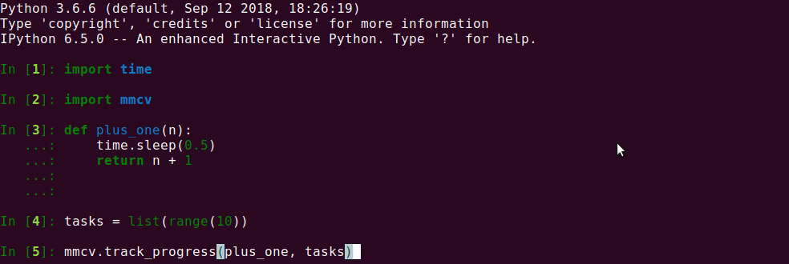
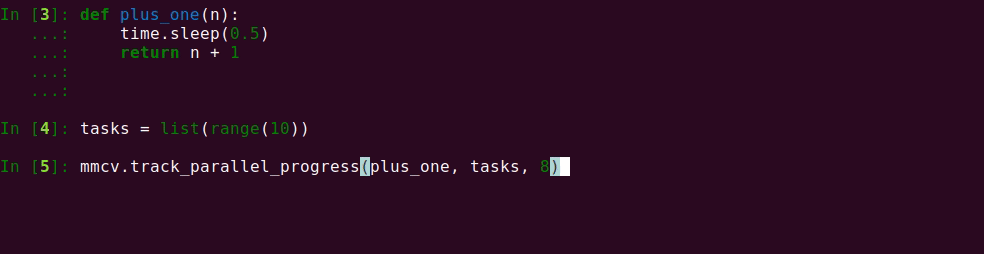

## 辅助函数

### 进度条

如果你想用一个函数来批处理一组数据并跟踪进度， `track_progress` 可能可以满足你的需求。它能以进度条的形式展示进度，以及显示剩余时间。（内部实现为for循环）

```python
import mmcv

def func(item):
    # 处理单项数据的操作
    pass

tasks = [item_1, item_2, ..., item_n]

mmcv.track_progress(func, tasks)
```

输出如下动图所示。


如果你需要多线程来处理数据，你可以尝试 `track_parallel_progress` 。

```python
mmcv.track_parallel_progress(func, tasks, 8)  # 8 workers
```



如果你仅仅只需要迭代或枚举每一个数据项并可视化进度,你可以尝试 `track_iter_progress` 。

```python
import mmcv

tasks = [item_1, item_2, ..., item_n]

for task in mmcv.track_iter_progress(tasks):
    # do something like print
    print(task)

for i, task in enumerate(mmcv.track_iter_progress(tasks)):
    # do something like print
    print(i)
    print(task)
```

### 计时器

`Timer` 能很方便地计算代码块的执行时间。

```python
import time

with mmcv.Timer():
    # simulate some code block
    time.sleep(1)
```

或者尝试 `since_start()` 和 `since_last_check()`. 前者返回计时器启动后运行时长，后者返回最近一次查看计时器后运行时长。


```python
timer = mmcv.Timer()
# code block 1 here
print(timer.since_start())
# code block 2 here
print(timer.since_last_check())
print(timer.since_start())
```
