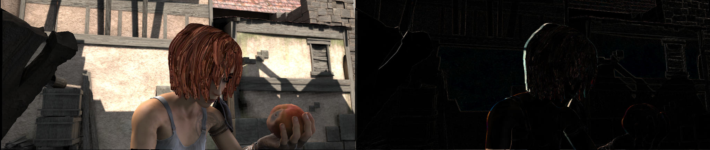

## 视频

视频模块提供了以下的功能：

- 一个 `VideoReader` 类，具有友好的 API 接口可以读取和转换视频
- 一些编辑视频的方法，包括 `cut` ， `concat` ， `resize`
- 光流的读取/保存/变换

### VideoReader

`VideoReader` 类提供了和序列一样的接口去获取视频帧。该类会缓存所有被访问过的帧。

```python
video = mmcv.VideoReader('test.mp4')

# 获取基本的信息
print(len(video))
print(video.width, video.height, video.resolution, video.fps)

# 遍历所有的帧
for frame in video:
    print(frame.shape)

# 读取下一帧
img = video.read()

# 使用索引获取帧
img = video[100]

# 获取指定范围的帧
img = video[5:10]
```

将视频切成帧并保存至给定目录或者从给定目录中生成视频。

```python
# 将视频切成帧并保存至目录
video = mmcv.VideoReader('test.mp4')
video.cvt2frames('out_dir')

# 从给定目录中生成视频
mmcv.frames2video('out_dir', 'test.avi')
```

### 编辑函数

有几个用于编辑视频的函数，这些函数是对 `ffmpeg` 的封装。

```python
# 裁剪视频
mmcv.cut_video('test.mp4', 'clip1.mp4', start=3, end=10, vcodec='h264')

# 将多个视频拼接成一个视频
mmcv.concat_video(['clip1.mp4', 'clip2.mp4'], 'joined.mp4', log_level='quiet')

# 将视频缩放至给定的尺寸
mmcv.resize_video('test.mp4', 'resized1.mp4', (360, 240))

# 将视频缩放至给定的倍率
mmcv.resize_video('test.mp4', 'resized2.mp4', ratio=2)
```

### 光流

`mmcv` 提供了以下用于操作光流的函数：

- 读取/保存
- 可视化
- 流变换

我们提供了两种将光流dump到文件的方法，分别是非压缩和压缩的方法。非压缩的方法直接将浮点数值的光流
保存至二进制文件，虽然光流无损但文件会比较大。而压缩的方法先量化光流至 0-255 整形数值再保存为
jpeg图像。光流的x维度和y维度会被拼接到图像中。

1. 读取/保存

```python
flow = np.random.rand(800, 600, 2).astype(np.float32)
# 保存光流到flo文件 (~3.7M)
mmcv.flowwrite(flow, 'uncompressed.flo')
# 保存光流为jpeg图像 (~230K)，图像的尺寸为 (800, 1200)
mmcv.flowwrite(flow, 'compressed.jpg', quantize=True, concat_axis=1)

# 读取光流文件，以下两种方式读取的光流尺寸均为 (800, 600, 2)
flow = mmcv.flowread('uncompressed.flo')
flow = mmcv.flowread('compressed.jpg', quantize=True, concat_axis=1)
```

2. 可视化

使用 `mmcv.flowshow()` 可视化光流

```python
mmcv.flowshow(flow)
```


3. 流变换

```python
img1 = mmcv.imread('img1.jpg')
flow = mmcv.flowread('flow.flo')
warpped_img2 = mmcv.flow_warp(img1, flow)
```

img1 (左) and img2 (右)


光流 (img2 -> img1)


变换后的图像和真实图像的差异


